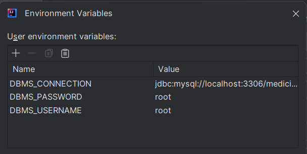
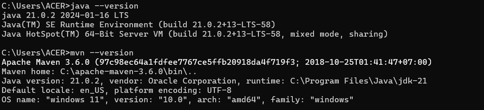

# Medicine service api (E-Commerce Website)

- This is a project while I learn Spring boot
- Tech:
    - Spring boot
    - Spring security
    - Maven
    - JWT (Json Web Token)
    - Docker (Run database)
    - Swagger (Spring doc)
- IDE:
    - IntelliJ IDEA

# Features:
- Authentication, Authorization
- CRUD
- Validator (not null, format, check duplicate,...)
- Paging and sorting
- Ordering 
- Check quantity in product when ordering

# How to run
- Clone this repository
- Make sure you are using JDK 17
- Install extension [Lombok](https://projectlombok.org/) in IntelliJ IDEA

## Run by Application 
- Step 1: Install MySql Workbench and setup environment variable in file application.yml
  
- Step 2: Install maven and Jdk in computer
  
- Step 3: build app
  ``mvn package -DskipTests``
- Finally: Run application in intelliJ or run application in Command Prompt
  
## Run by Docker 
- Step 1: Install [docker](https://www.docker.com/products/docker-desktop/) desktop
- Step 2: Install image Mysql
  - ``docker pull mysql:8.0.37-debian``
  - ``docker run --name mysql-8.0.37 -p 3306:3306 -e MYSQL_ROOT_PASSWORD=<chage_password> -d mysql:8.0.37-debian``
- Step 3: Pull image medicine-service 
  - ``docker pull thanhtuanhht/medicine-service``
  - ``docker run --name medicine-service -p 8080:8080 -e DBMS_CONNECTION=jdbc:mysql://<change_ipmysql_docker>:3306/medicine_service thanhtuanhht/medicine-service:0.0.1``
- Access http://localhost:8080/medicine/swagger-ui/index.html to see swagger doc